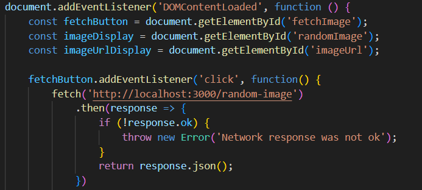
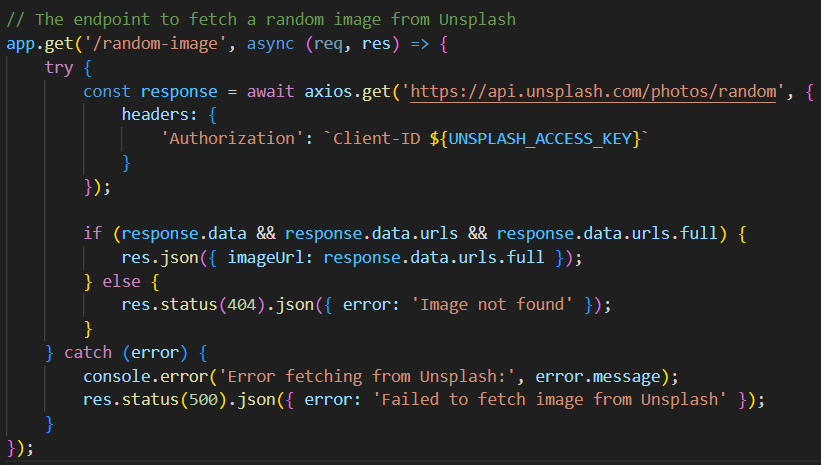

# Image Fetch Microservice

## Purpose
This microservice receives a HTTP request on the '/random-image' endpoint, and the server uses Axios to make a request to the Unsplash API and send a JSON object containing the image url from Unsplash back to the user UI. 

## Quick Start
- Install and update the package" `npm install`
- Start the Server:  run 'server.js' using Node.js which starts an Express server on port 3000: `node server.js`
- Open the UI.html page and send a HTTP GET request on the `/random-image` endpoint, by clicking the "Fetch Random Image" button. 
- Fetch data from Unsplash: when a reques is received on the `/random-image` endpoint, the server uses Axios to make a request to the Unsplash API. 
- Return image data: The server receives the image data from Unsplash, and sends the image url back to the user's UI.
- Error handling: The server sends an error message back to the user if there is an error at any point, for example network issue, Unsplash API issue or no data received. 

## Request data & Receive data
- Endpoint: `/random-image`
- Request data: Using Fetch in JavaScript

- Receive data: Using Axios in Node.js

## Using Postman API as an alternative to see the microservice in action
1. Open Postman and create a new tab to start a new request;
2. Set the request type as 'GET';
3. Enter the URL'http://localhost:3000/random-image'.
4. Hit 'Send'. 
View the response body after the the user send a "Fetch" request. 

## UML Sequence Diagram